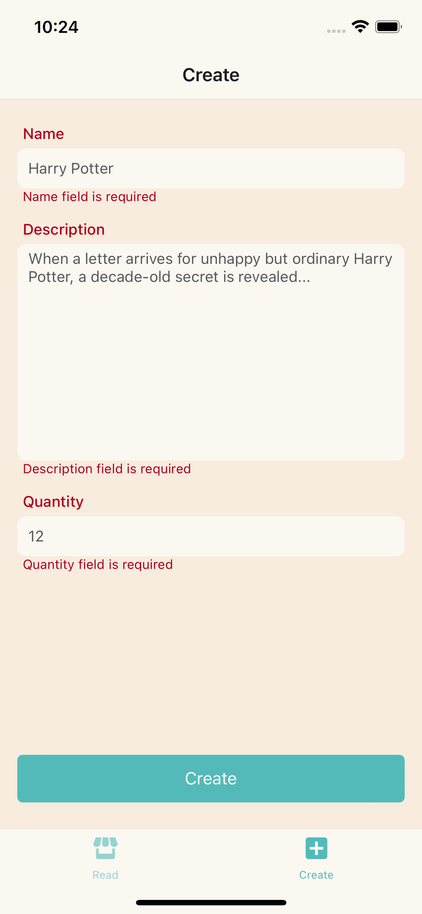

# Webshop

Az alkalmazásban megtekinthetők a webshopban elérhető termékek. A meglévő termékeket lehet törölni, valamint szerkeszteni is. Ezen kívül lehetőség van újak létrehozására is.

## Alkalmazás elindítása

Az alkalmazás alapvetően **.env** fájlban lévő konfigurációs fájlokat fogja beolvasni. Ezt most annak érdekében, hogy könnyű legyen létrehozni feltöltöttem, de egyébként ezt érdemes a **.gitignore** fájlba belerakni, és minden fejlesztő csak magának hozza létre lokálisan

### iOS build

Az iOS alkalmazás futtatásához a következő parancsok egymás utáni futtatására van szükség.

    yarn
    cd ios && pod install
    npx react-native run-ios
    // npx react-native run-ios --device (amennyiben valós eskzözön szeretnénk folytatni)

### Android build

Az android alkalmazás futtatásához a következő parancsok egymás utáni futtatására van szükség

    yarn
    npx react-native run-android

## Elkészült alkalmazás képek

  
 
 

